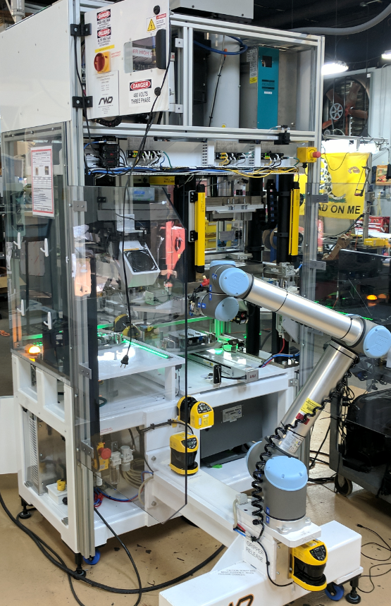
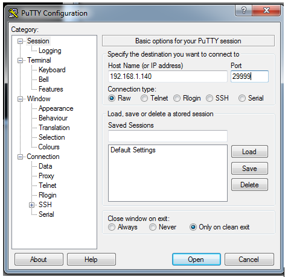
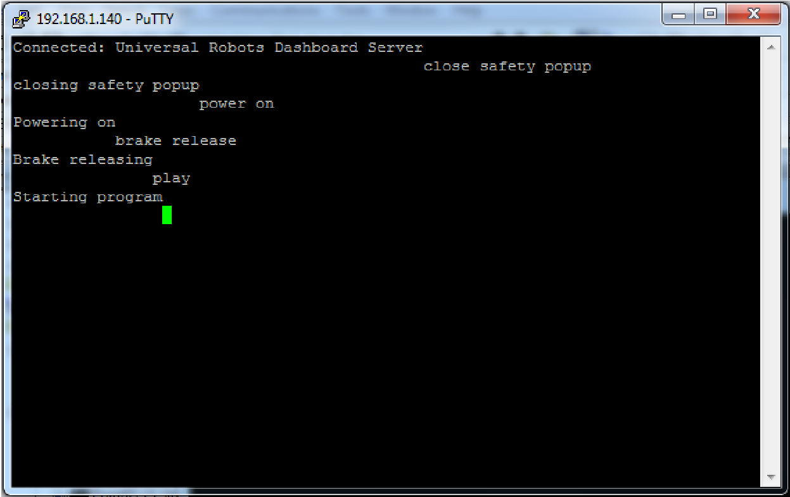
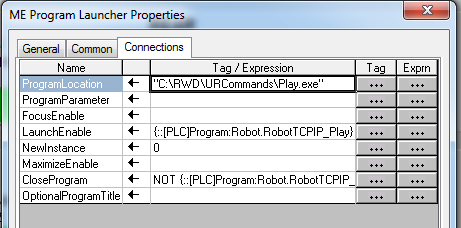

# C++ for Sending Ethernet TCP/IP Commands to a Universal Robot

### The Problem:
Unlike most industrial automation equipment, Universal Robots are not capable of an automatic safety reset after an Emergency Stop.  This is deliberate, as these robots have the ability to be used in a standalone scanario which should not be automatically reset.  However, in most cases, they are just one component of an automated machine which has its own safety circuits that govern all the possible hazzards of the machine and one method of safety reset for the entire machine.  When UR robots are e-stopped by the machine, they require the operator to acknowledge prompts on the robot's pendant before it can run again.  This is an annoyance for operators who can press one button to reset the safety of every other aspect of the machine, but must walk over to the robot's pendant and acknowledge some prompts before the robot can be brought back up too.

### The Solution:
When the machine's guarding and safety devices ensure that the whole machine is safe to recover from an e-stop condition, it is not necessary to reset the robot separately.  This repo gives instructions of one way to reset a UR robot in this situation.  It is done through the robot's Dashboard Server Commands over ethernet TCP/IP.

### Overview:
The sequence of steps required for an operator to reset the robot using its pendant can instead be accomplished by sending an appropriate sequence of ethernet TCP/IP commands.  In my particular application, I have an Allen-Bradley Safety PLC which communicates on a local EtherNet/IP network to various devices on the machine, the UR robot being one of them.  My PLC does not have the ability to send ethernet TCP/IP commands without the use of an additional gateway.  However, my HMI is a touchscreen computer running Rockwell's FactoryTalk View ME and the computer is connected to the same local network as all the other devices including the PLC and robot.  Here is the basic outline:
1. The Safety PLC determines that safeguards are met and the safety can be reset
2. The operator presses the blinking Reset button
3. The PLC triggers an ActiveX control via the FactoryTalk View ME HMI software.
4. The ActiveX control launches an .exe that is saved on the computer
5. The .exe opens a web socket, sends an ethernetTCP/IP command to the robot, and closes the socket
6. The robot responds to the command
7. As appropriate, the PLC sends the remaining commands in similar fasion

### Safety:
I'd like to emphasize that by using the methods I am describing, you need to be __sure__ that it is in fact safe for the robot to return to operation.  It is your responsibility as the integrator.  Resetting safety circuits requires a manual reset for a reason.  In the partially completed machine pictured below, the machine can ensure that the robot's area is clear through use of guarding, safety light curtains, and safety area scanners.  

### TCP/IP Commands:
You can read about the UR Dashboard Server Commands [here](https://www.universal-robots.com/articles/ur/dashboard-server-cb-series-port-29999/ "Dashboard Server Commands").  I would recommend familiarizing yourself with the commands by trying them out using PuTTY or similar program.  Create a raw connection from your computer to the robot's IP address on port 29999.  Then you can enter the commands one at a time in the terminal.  The sequence pictured will recover from a (not Protective Stop) e-stop condition.  After sending each command, you recieve a handshake back from the robot.  The order of commands and allowing for the previous action to complete are important and I will talk about this more later.

 

There is an additional command `unlock protective stop` which is needed if the robot encounters a protective stop.  Use caution with this command and make sure that you have resolved the cause of the protective stop first.  This command only works after 5 seconds have passed since the protective stop event.

### C++ Code:
This repo contains "TCPIP_SocketClient.cpp" which is a modified version of code written by Jose Davis Nidhin and the original can be found at [github.com/josnidhin/SocketClient](https://github.com/josnidhin/SocketClient "josnidhin git hub").  When you open TCPIP_SocketClient.cpp, you will need to edit line 13 `#define IP "192.168.1.140"` by entering the IP address of the robot.  You will also need to edit line 87 `char command[] = "play";`. Line 87 is where you specify which command to send.  Remember that each command is sent individually, so you will need to compile a program for each one of the commands.  For simplicity, I compiled them using the command in the filename.  So I ended up with Play.exe, CloseSafetyPopup.exe, ClosePopup.exe, PowerOn.exe, BrakeRelease.exe, and UnlockProtectiveStop.exe.  At this point, you can test these out by connecting to the machine's network and running them.

### HMI Computer:
Now copy all the .exe programs to the HMI computer.  If you have a firewall, you may need to allow these programs through.  Check the version of your FactoryTalk View Studio and that of the HMI's FactoryTalk View ME Station.  Try to use the same version for both because otherwise, you may end up with different versions of the ActiveX control and it won't work.

### PLC:
As I mentioned earlier, the order of the commands is important.  It is also important to wait for the robot to successfully change states and handshake before sending the next command.  And some commands such as `unlock protective stop` and `close popup` are only needed in certain situation.  I have created a sequence that steps through the commands appropriately for my machine and you can find those exported rungs in the repo as "EstopRecover.L5X" for use in Studio 5000.  This is intended only as an example.  It is up to you to safely implement these commands into your unique machine.  You will find descriptive comments in the code that will make it easy to understand. 

### HMI Program:
Insert an ME Program Launcher ActiveX control into your project by going to the Objects menu, clicking ActiveX Control, and then selecting ME Program Launcher.  You will get the ME Program Launcher Properties window.  In the Connections tab, you will need to specify several parameters.  ProgramLocation is the path to one of your new .exe programs.  Set NewInstance to zero, which will prevent you from launching multiple instances of the .exe program.  LaunchEnable is the BOOL variable tag that you created in the PLC to trigger this control, and CloseProgram is the logical NOT of that variable.  

This will create a button on your HMI screen and you can launch the .exe program by either pressing that button or making the LaunchEnable variable True.  You can remove the button functionality by going to the Common tab of the ME Program Launcher Properties and unchecking the Visible check box.  Then you can resize the button to a very small size and put it in an unused corner of the screen.  You will then need to follow this process to create ActiveX controls for each one of the .exe programs.  The ActiveX controls you put on your HMI screen will only work if that screen is the currently displayed screen, so you will have to copy and paste them onto every screen.

### Future Development:
Currently, this code does not do anything with the responses recieved from the robot.  I may come back and improve upon that in the future.  But for now it does not add much value because the state of the robot is already known in greater detail by the PLC through the EtherNet/IP communication.
